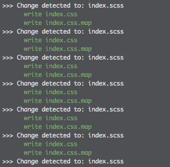
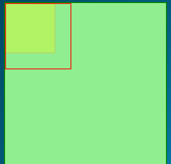

## 学到什么？

这个任务其实JS是很简单的，简简单单两句话就能解决问题：

```js
var body = document.querySelector('body');
var button = document.querySelector('.toggle');

button.addEventListener('click', function(){

    body.classList.toggle('on');

}, false);

```

虽然只有几行代码，但是一样还是有需要细细品味的知识：

1. 选择器：

> document.querySelector(selectors);

+ 返回元素节点对象

+ 选择器遵守CSS选择器语法
x

遍历文档后找不到一个返回`null`,兼容性：

说到它，就必要聊聊它的兄弟： 

> document.querySelectorAll(selectors);

+ 返回元素节点对象数组，必须注意，这个nodelist是不会更新的。
+ 选择器支持多个，用`,`分隔。
+ 若存在伪元素选择器，返回空。

它们两兄弟其实都是来之[Selector API](https://www.w3.org/TR/selectors-api/#grammar),根据文档，这里还可以拓展：

> element.querySelector(seletors);

这里是什么意思呢？其实跟上面两个一样，上面的方法可以选择`element`中对应选择器的子元素！！厉害，这还需要为了选择器引入`jQuery`吗，*不需要*。

2. 伪元素的运用

### 文档流中



### 它们之间存在有堆叠关系时


```html
    <section class="pesude"></section>
```

```css
.pesude {
  position: relative;
  width: 20rem;
  height: 20rem;
  border: 2px solid green;

  background-color: lightgreen;
  z-index:10;
}

.pesude:before {
  position: absolute;
  content: '';
  display: block;
  width: 6rem;
  height: 6rem;
  border: 2px solid orange;
  background-color: yellow;
  opacity: .3;
}
.pesude:after {
  position: absolute;
  content: '';
  display: block;
  width: 8rem;
  height: 8rem;
  border: 2px solid red;
  opacity: .8;
}
```



看起来很厉害的样子，但是能用来干干什么呢？

- 多边框实现
- 多背景实现

这两个是最能想到的点，当然，现在多边框我们可以通过`box-shadow`来实现，语法和代码量都会简单
点的。

而这个项目里大量应用了伪元素来实现空间的扩容。

## 一开始没想到的点

以为自己完全了解了伪元素，后来从源代码中发现：

```css
.toggle:before, .toggle:after {
  display: flex;
}
```

其实释然，既然它们就是在页面表现就是盒子，那能应用flex就是当然的。

## Transform

个人这里一直有一个误会关于坐标系统的：

![./images/coord_in_R2.png]

- rotate()
围绕某点旋转，正值为顺时针方向，负值为逆时针方向

- rotateX()
以X为轴旋转，正值为顺时针方向，负值为逆时针方向

- rotateY()
以Y轴为中心旋转，正值为顺时针方向，负值为逆时针方向

- rotateZ()
以Z轴为中心旋转，正值为顺时针方向，负值为逆时针方向

- rotate3d()
以(x, y, z)为中心轴旋转，正值为顺时针方向，负值为逆时针方向

以上，顺时针，逆时针都是以坐标正方形参考，其中除3d外，其他跟`transform-origin`严重相关。

