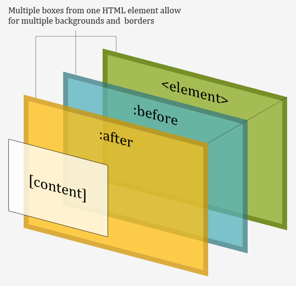

## 学到什么？

这个任务其实JS是很简单的，简简单单两句话就能解决问题：

```js
var body = document.querySelector('body');
var button = document.querySelector('.toggle');

button.addEventListener('click', function(){

    body.classList.toggle('on');

}, false);

```

虽然只有几行代码，但是一样还是有需要细细品味的知识：

1. 选择器：

> document.querySelector(selectors);

+ 返回元素节点对象

+ 选择器遵守CSS选择器语法

遍历文档后找不到一个返回`null`,兼容性：

说到它，就必要聊聊它的兄弟： 

> document.querySelectorAll(selectors);

+ 返回元素节点对象数组，必须注意，这个nodelist是不会更新的。
+ 选择器支持多个，用`,`分隔。
+ 若存在伪元素选择器，返回空。

它们两兄弟其实都是来之[Selector API](https://www.w3.org/TR/selectors-api/#grammar),根据文档，这里还可以拓展：

> element.querySelector(seletors);

这里是什么意思呢？其实跟上面两个一样，上面的方法可以选择`element`中对应选择器的子元素！！厉害，这还需要为了选择器引入`jQuery`吗，*不需要*。

2. 伪元素的运用




